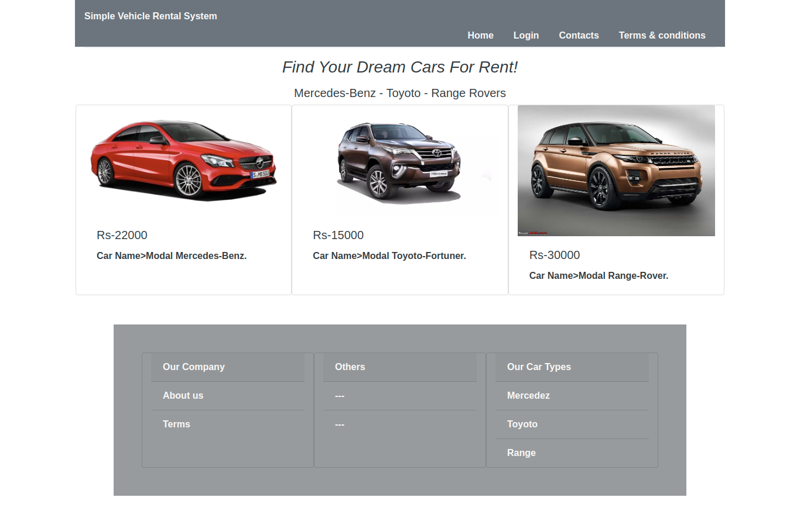

# masai-sprint-4
# Car Rental app

# Table of Contents:
1.General Information
2.Technologies
3.Features
4.setUp

# 1.General Information

Car Rental app lets user select cars of their own choice .Find your favourite car and pick your favourit color and rent according 
to your choice in terms of price and color. Booking system is also included. This app lets you book car hassel free.

# 2. Technologies

Bootstrap
CSS
HTML
Javascript

# 3. SetUP

To run this project,install it Locally using npm
npm install
git clone https://github.com/madhurisonawat/Holiday-app.git
npm run start

# Image of app
!()
